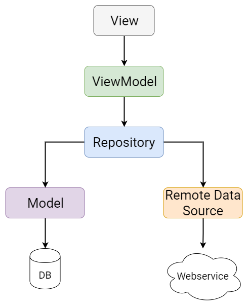

# TendoMini

 

## Clean architecture with 3 layers
- Data (for database, API and preferences code)
- Domain (for business logic and models)
- Presentation (for UI logic, with MVVM)

 
 
## MVVM Architecture 
MVVM (Model-View-ViewModel) is one of the best options for Android development. It has even fully supported and encouraged by Google with their first-party libraries.
In case of MVVM, there are three inherent parts, which help in accomplishing the separation of concerns: models, views and view models. You can also add a repository, which acts as a single source of truth for all the data

### View
In the context of MVVM, View doesn’t mean the base class of all the TextViews and RecyclerViews. Instead it’s a part of your app which handles what the user sees and touches on the screen. In other words, a View does all the things an Activity or a Fragment can do.

### ViewModel
A ViewModel is like a glue between a View and business logic. It provides data for the view by getting it from the repository.

### Model
Model is where you put all the business specific code. While technically there is an intermediate step between the ViewModel and the Model in the form of a Repository, you can kind of regard everything from Repository downwards as its own group of classes far away from the user interface. These operate on your app’s data and fetch it from the local database or from the network.

### Connectedness of MVVM components
Not only that the View observes data in the ViewModel but also the ViewModel observes data in the Repository which in turn observes data coming from the local database and from the remote data source.
