# TendoMini

 

## Clean architecture with 3 layers
- Data (for database, API and preferences code)
- Domain (for business logic and models)
- Presentation (for UI logic, with MVVM)

 
 
## MVVM Architecture 
MVVM (Model-View-ViewModel) is one of the best options for Android development. It has even fully supported and encouraged by Google with their first-party libraries.
In case of MVVM, there are three inherent parts, which help in accomplishing the separation of concerns: models, views and view models. You can also add a repository, which acts as a single source of truth for all the data

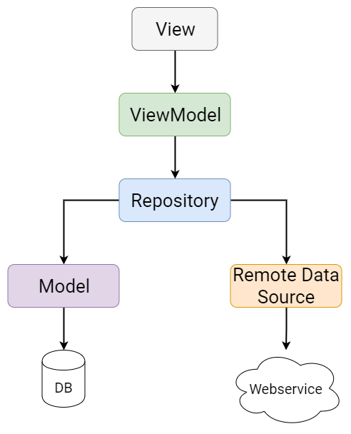

### View
In the context of MVVM, View doesn’t mean the base class of all the TextViews and RecyclerViews. Instead it’s a part of your app which handles what the user sees and touches on the screen. In other words, a View does all the things an Activity or a Fragment can do.

### ViewModel
A ViewModel is like a glue between a View and business logic. It provides data for the view by getting it from the repository.

### Model
Model is where you put all the business specific code. While technically there is an intermediate step between the ViewModel and the Model in the form of a Repository, you can kind of regard everything from Repository downwards as its own group of classes far away from the user interface. These operate on your app’s data and fetch it from the local database or from the network.

### Connectedness of MVVM components
Not only that the View observes data in the ViewModel but also the ViewModel observes data in the Repository which in turn observes data coming from the local database and from the remote data source.

## Hardware and Software Requirements
Requires a smart phone with Android operating system (OS)
The minimum Android version should be 5.0 and up to avail all the features in the application.

## Pages
Launch the application by clicking on the Tendo Mini icon on your device as shown in the image below.
When Tendo Mini application is launched for the first time, the login screen displayed. 
User must enter the phone number and password to login. On successful login, the user is directed to home page 

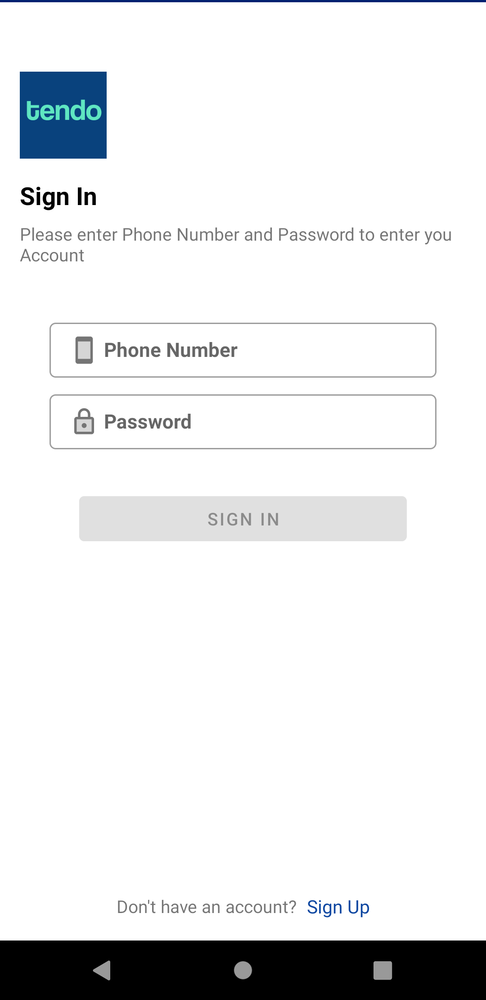

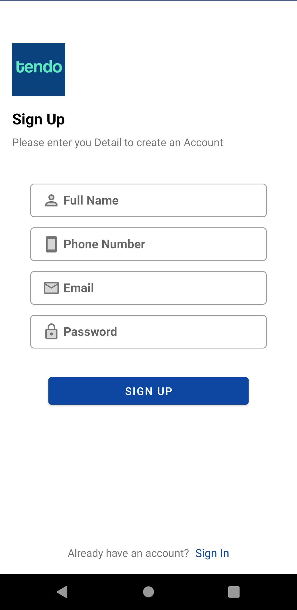

### Home page
The list of product categories is displayed on the top sections and the list of all product is displayed under the section of product category 

On click of a product the user is navigated to the product detail screen which displays the details of the product selected 

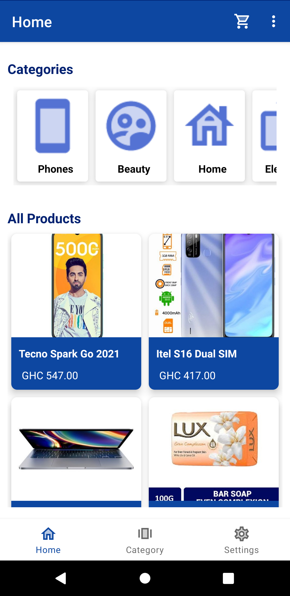

### Product Detail Screen
On click of the share icon a dialog is display with the product image, name, description and price which is editable before sharing. 
On click of the button, add to cart the button the product is added to the cart for checkout

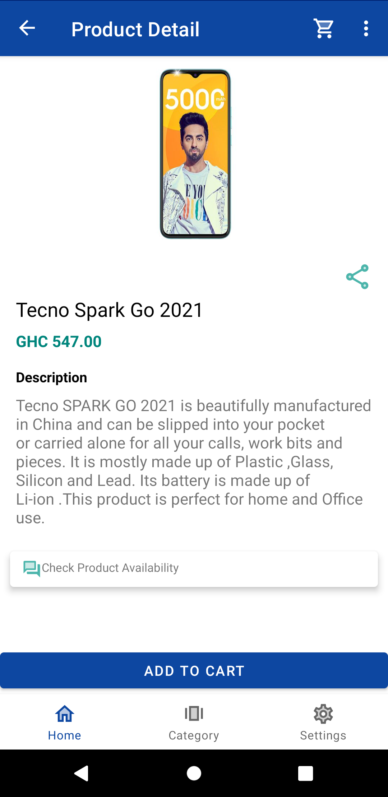

### Category Page
The list of product categories is displayed on this page.
The search bar on top of list of product categories enables the user to search the product categories by the name.

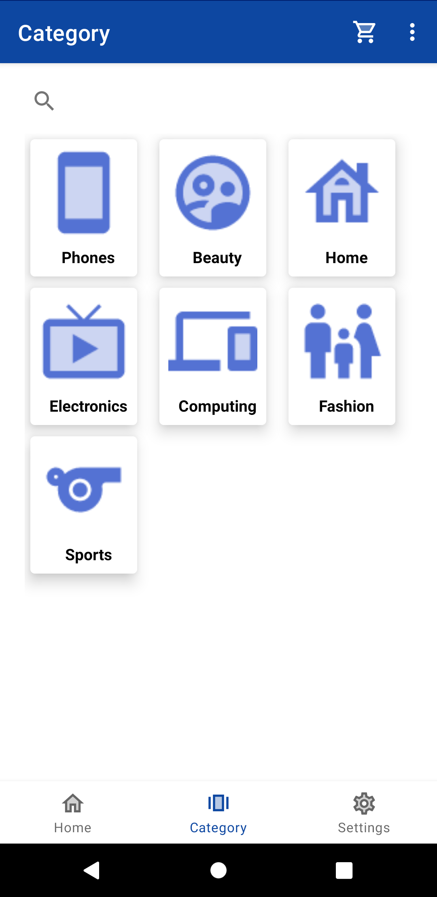

On click of a product category the user is navigated to products screen where list of product is displayed based on the category selected
The search bar on top of list of products enables the user to search the products by the name.

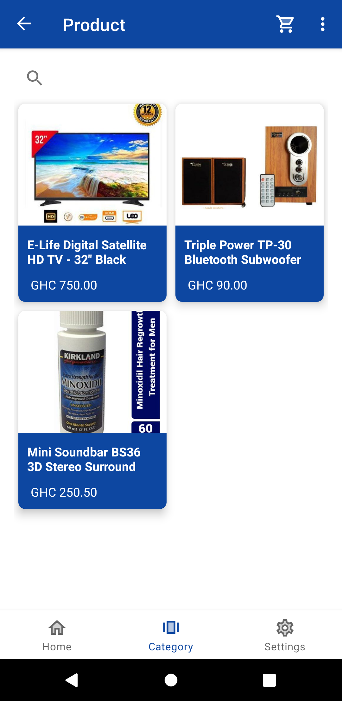

### Cart Page
To navigate to the cart page the shopping cart icon on the toolbar is clicked
The cart list item card
•	Plus sign for increasing product quantity
•	Minus sign for decreasing product quantity
•	Delete sign for removing product from cart list 

The total cost and number of the items in the cart list is shown bottom of the cart list
Right below that is a spinner with a list of delivery location to select from and description 
The next button navigates the user to the order summary page where they can submit their order by pressing the submit order button 

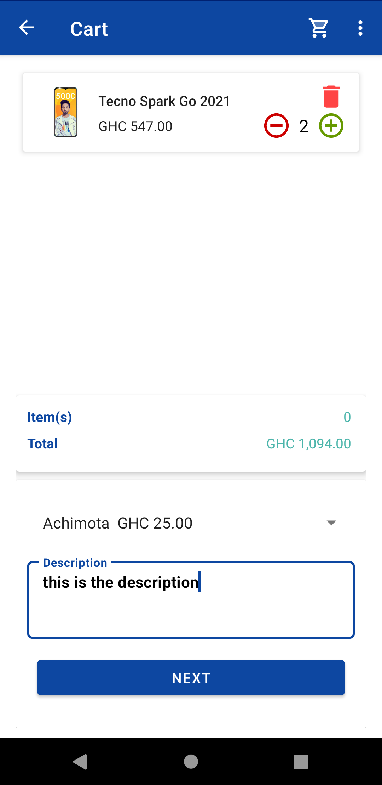

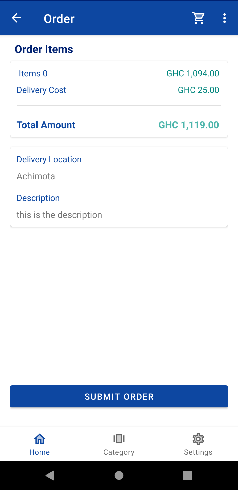

### Settings Page
This page shows an icon and text for orders and about 
On click of the orders the user is navigated to order page

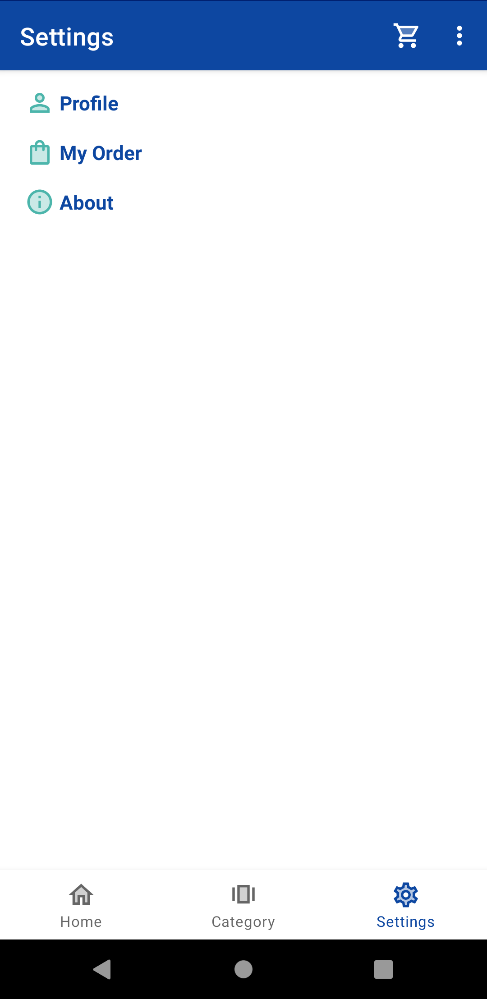

### Order Page
This shows the list of orders made by the user, on click of an order the user is directed to the order detail screen where the user can track the order through a chat conversation on WhatsApp. 

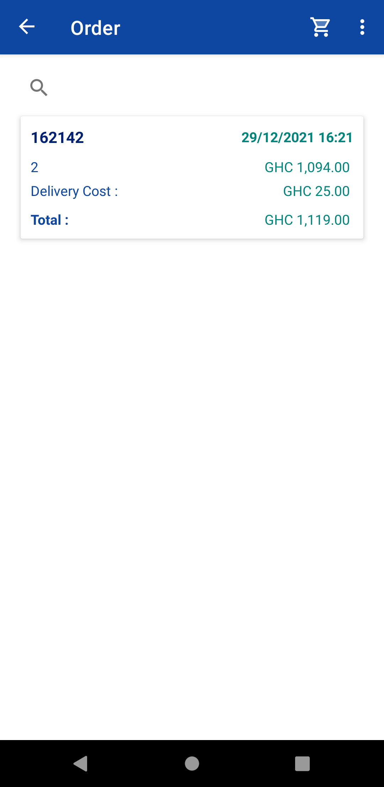

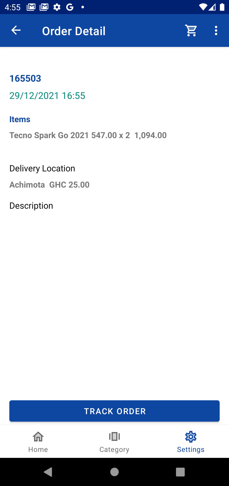

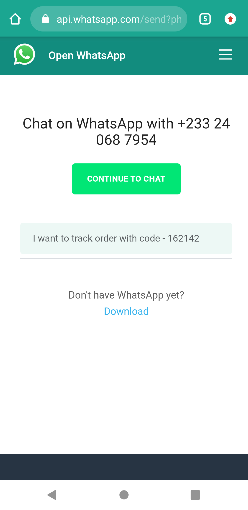
